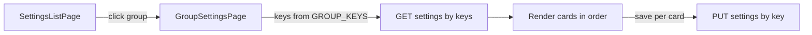

# Settings Admin: nhóm (groups) và điều hướng hai cấp

> **Chuẩn hiện tại:** [`admin/docs/SETTINGS-GROUPS-AND-ROUTES.md`](../../admin/docs/SETTINGS-GROUPS-AND-ROUTES.md). File này giữ làm tham khảo.

Tài liệu mô tả **luồng giao diện admin** và **cách gắn với DB** khi bạn muốn:

1. Màn đầu: **danh sách các nhóm settings** (ví dụ “Trang chủ”, “Toàn site”, “About”).
2. Click một nhóm: mở **trang chi tiết** chỉ chứa các **setting card** thuộc nhóm đó — **mỗi card = một row** trong bảng `settings` (theo `key`).

Ví dụ code registry: [`admin/docs/examples/settings-registry.example.ts`](../../admin/docs/examples/settings-registry.example.ts).

---

## 1) Cột `type` trong bảng `settings`

**Không cần.** Định danh loại form / cấu trúc dữ liệu đã được gắn với **`key`** qua registry trong code; phiên bản shape dùng **`value.version`**.

- Nếu schema DB hiện tại vẫn có cột `type`: có thể **drop** sau migration, hoặc bỏ dùng và xóa ở bản Drizzle schema sau.

---

## 2) Nhóm settings lưu ở đâu?

**Không bắt buộc có bảng `setting_groups` trong DB** cho use case này.

- **Nhóm** = khái niệm **điều hướng + thứ tự card** trong admin.
- Nguồn sự thật gợi ý: **code** — một cấu hình `groups` + map `groupId -> keys[]` (thứ tự trong array = thứ tự hiển thị card).

Lý do:

- Thêm/sửa nhóm không cần migration DB.
- Thứ tự card kiểm soát bằng array, rõ ràng.
- Mỗi row DB vẫn chỉ cần `key` + `value`; không cần `group_id` trên row trừ khi sau này bạn muốn query SQL theo nhóm (khi đó mới cân nhắc thêm cột hoặc bảng).

---

## 3) Cấu trúc gợi ý trong code

### 3.1 Định nghĩa nhóm (cho màn danh sách)

Mỗi nhóm có metadata hiển thị trên list:

- `id` — ví dụ `site:home`, `site:global` (slug dùng trong URL).
- `title` — “Trang chủ”, “Cài đặt chung”, …
- `description` — một dòng mô tả (optional).
- `icon` / `order` — optional cho sidebar hoặc sort list.

### 3.2 Map nhóm → danh sách `key` (thứ tự card)

```ts
// Ví dụ minh họa — không phải code thực tế trong repo
const SETTINGS_GROUPS: Array<{
  id: string;
  title: string;
  description?: string;
  order: number;
}> = [
  { id: "site:global", title: "Toàn site", description: "...", order: 1 },
  { id: "site:home", title: "Trang chủ", description: "...", order: 2 },
];

const GROUP_KEYS: Record<string, string[]> = {
  "site:global": ["site.global.footer", "site.global.seoDefaults"],
  "site:home": ["site.home.hero", "site.home.featuredProjects"],
};
```

- **Thứ tự card** = thứ tự phần tử trong `GROUP_KEYS[groupId]`.
- Mỗi `key` vẫn có **entry đầy đủ** trong registry (defaultValue, formConfig, migrate, …).

---

## 4) Route và luồng dữ liệu

| Route | Mục đích |
|-------|----------|
| `/admin/settings` | Trang **danh sách nhóm** — render `SETTINGS_GROUPS` (sort theo `order`). |
| `/admin/settings/[groupId]` | Trang **một nhóm** — `keys = GROUP_KEYS[groupId]`, gọi API load settings theo `keys`, render từng card theo thứ tự array. |

### API

- `GET /admin/settings?keys=key1,key2,...`  
  - Backend: `ensureSettingsByKeys(keys)` để bootstrap row thiếu.
  - Trả về mảng `items` (có thể map theo thứ tự `keys` để UI khớp thứ tự card).

- `PUT /admin/settings/:key`  
  - Lưu một card (một row).

Không cần endpoint “list groups” nếu groups định nghĩa tĩnh trong frontend; hoặc có thể `GET /admin/settings/groups` trả metadata từ backend nếu đồng nhất với mobile app sau này.

---

## 5) Gắn với card title / description trong DB

Bạn đã chọn lưu **tiêu đề và mô tả card** trong `value` (ví dụ `value.cardMeta`). Khi render trang nhóm:

- Thứ tự card lấy từ **`GROUP_KEYS[groupId]`**.
- **Title/description hiển thị** trên card đọc từ `value.cardMeta` của từng row (sau khi migrate).

Nếu row chưa tồn tại, bootstrap từ `defaultValue` trong registry (có `cardMeta` mặc định).

---

## 6) Sơ đồ luồng



---

## 7) Tóm tắt

- **Bỏ `type`** khỏi bảng; đủ `key` + `value` (+ `updated_at`).
- **Nhóm** = cấu hình trong code + **array `key` có thứ tự**; không cần cột `order` trên row.
- **Hai route**: list nhóm → chi tiết nhóm (nhiều card).
- **Mỗi card = một row**; load và save theo `key` như đã thiết kế.
