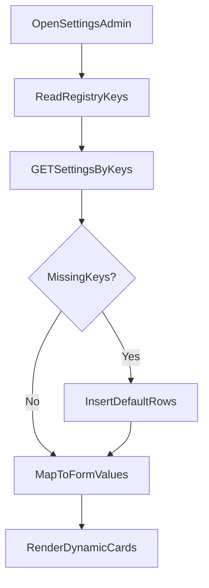
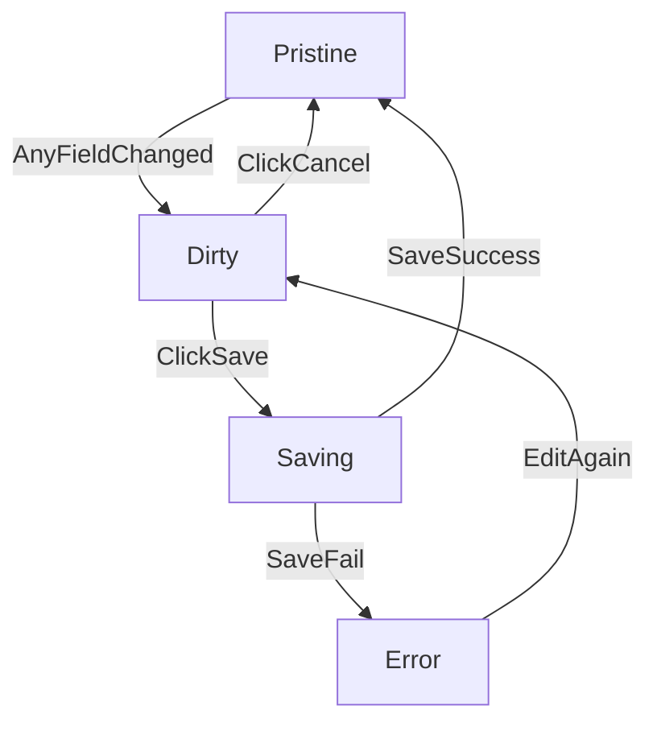

# Settings Admin Flow (One Table, Key + Version)

> **Chuẩn hiện tại:** tài liệu đầy đủ và được cập nhật nằm trong app admin: [`admin/docs/SETTINGS.md`](../../admin/docs/SETTINGS.md). File này giữ làm tham khảo; khi có mâu thuẫn, ưu tiên `admin/docs/`.

Tài liệu này chốt giải pháp quản lý settings trên admin với **một bảng duy nhất** theo hướng **không dùng `type`**. Mỗi row được nhận diện bằng `key`, còn thay đổi cấu trúc dữ liệu quản lý bằng `value.version`.

## 1) Mục tiêu và phạm vi

- Chỉ dùng **1 bảng `settings`**.
- Mỗi setting item tương ứng **1 row**.
- Dữ liệu cố định và đa ngôn ngữ nằm chung trong `value` (JSONB).
- UI admin hiển thị theo **card độc lập**, save/cancel theo từng card.
- Không phụ thuộc bảng `setting_translations`.
- Không dùng cột `type`; dùng `key` + `version`.

## 2) Data model đề xuất

## Bảng `settings`

| Cột | Kiểu | Ý nghĩa |
|-----|------|---------|
| `key` | `varchar` (PK) | Định danh setting item, ví dụ `site.home.hero` |
| `value` | `jsonb` | Toàn bộ dữ liệu setting (non-localized + localized + `version`) |
| `updated_at` | `timestamp` | Thời điểm cập nhật |

## Shape chuẩn cho `value`

Tiêu đề / mô tả card admin lưu trong **`cardMeta`** (cùng document). Ví dụ:

```json
{
  "version": 1,
  "cardMeta": {
    "title": "Hero trang chủ",
    "description": "Cấu hình hero và media."
  },
  "nonLocalized": {
    "profileImageUrl": "https://ik.imagekit.io/your-id/portrait.png",
    "cvFileUrl": "https://cdn.example.com/cv/anh-nguyen-cv.pdf",
    "aboutPath": "/about"
  },
  "locales": {
    "vi": {
      "badge": "FULL-STACK DEVELOPER",
      "headline": {
        "parts": [
          { "text": "Biến ý tưởng thành ", "emphasis": false },
          { "text": "hiện thực số", "emphasis": true },
          { "text": ".", "emphasis": false }
        ]
      },
      "description": "Chào bạn, tôi là Anh Nguyễn...",
      "primaryCtaLabel": "Về tôi",
      "secondaryCtaLabel": "CV của tôi",
      "experienceLabel": "Kinh nghiệm",
      "experienceValue": "5+ Năm"
    },
    "en": {
      "badge": "FULL-STACK DEVELOPER",
      "headline": {
        "parts": [
          { "text": "Turn ideas into ", "emphasis": false },
          { "text": "digital reality", "emphasis": true },
          { "text": ".", "emphasis": false }
        ]
      },
      "description": "Hi, I'm Anh Nguyen...",
      "primaryCtaLabel": "About me",
      "secondaryCtaLabel": "My CV",
      "experienceLabel": "Experience",
      "experienceValue": "5+ Years"
    }
  }
}
```

## 3) Source of truth trong code: Settings Registry

Để UI không phụ thuộc việc DB đã có row hay chưa, cần một registry cố định trong code. Chi tiết: [`admin/docs/SETTINGS-REGISTRY.md`](../../admin/docs/SETTINGS-REGISTRY.md), [`SETTINGS-GROUPS-AND-ROUTES.md`](../../admin/docs/SETTINGS-GROUPS-AND-ROUTES.md).

Mỗi entry trong registry cần có:

- `key`: ví dụ `site.home.hero`
- `groupId` / `adminPageId`: ví dụ `site:home` — dùng để gom card vào cùng route (đồng bộ với map nhóm → keys)
- `defaultValue`: JSON mặc định đúng shape (có thể gồm `cardMeta`, `version`, …)
- `formConfig`: cấu hình dynamic form cho card; validation generate từ config (ví dụ `createDynamicFormSchema`) thay vì tách file schema riêng cho `value`
- `migrate`: (optional) nâng `value` từ version cũ lên latest
- mapper (nếu cần):
  - `toFormValues(value)` cho render form
  - `toPersistValue(formValues)` cho save

## Lợi ích

- DB trống vẫn render được.
- Thêm card mới chỉ cần thêm registry entry.
- Validation thống nhất giữa backend và frontend.

## 4) Flow load dữ liệu (kể cả DB trống)

Luồng chuẩn khi mở trang settings admin:

1. Frontend gửi danh sách `keys` cần hiển thị (lấy từ registry).
2. Backend query bảng `settings` theo các key.
3. Key nào chưa có row -> backend tự bootstrap bằng `defaultValue`.
4. Backend trả data đầy đủ cho tất cả key.
5. Frontend map sang form values và render card.



## 5) Flow save theo card

- Mỗi card có form state riêng (`pristine`, `dirty`, `saving`, `error`).
- Khi user đổi bất kỳ field nào trong card -> card `dirty`, hiện `Lưu thay đổi` và `Hủy thay đổi`.
- Save chỉ tác động card hiện tại:
  - validate payload
  - `upsert settings` theo `key`
  - cập nhật `updated_at`
- Cancel reset về snapshot dữ liệu gần nhất của card.



## 6) API contract đề xuất

## GET `/admin/settings`

- Query: `keys=hero,about,...`
- Hành vi:
  - đảm bảo đủ row theo keys (bootstrap nếu thiếu)
  - trả danh sách settings theo key

Response mẫu:

```json
{
  "items": [
    {
      "key": "site.home.hero",
      "value": {
        "version": 1,
        "nonLocalized": {},
        "locales": {}
      },
      "updatedAt": "2026-03-24T10:00:00.000Z"
    }
  ]
}
```

## PUT `/admin/settings/:key`

- Body:
  - `value` (JSON hoàn chỉnh của setting card)
- Hành vi:
  - validate `value` theo schema của `key`
  - upsert row theo `key`
  - trả row mới nhất

## 7) Dynamic form design cho card settings

Mỗi card render từ `formConfig` trong registry:

1. **Khối non-localized** ở trên.
2. **Khối localized** ở dưới bằng tabs (`vi`, `en`, ...).

Yêu cầu hành vi:

- Chuyển tab không làm mất dữ liệu tab khác.
- Dirty tracking theo card, không theo toàn trang.
- Save/Cancel nằm ở card action.
- Có thể khóa input trong card khi đang `saving`.

## 8) Validation và an toàn dữ liệu

- Validate ở form (UX): báo lỗi ngay field.
- Validate lại ở API (an toàn): reject payload sai schema.
- Nếu thiếu locale mới (ví dụ thêm `ja`), backend có thể:
  - tự điền từ default locale, hoặc
  - để object rỗng và yêu cầu admin nhập.

Khuyến nghị: luôn giữ ít nhất 1 locale mặc định có đủ field bắt buộc.

## 9) Chiến lược bootstrap dữ liệu

Có 2 cách, có thể dùng đồng thời:

- **Lazy bootstrap khi GET settings**: cách chính, tự hồi phục tốt.
- **Seed command lúc deploy**: tối ưu khởi tạo ban đầu.

Khuyến nghị: dùng lazy bootstrap làm chuẩn để tránh phụ thuộc thao tác thủ công.

## 10) Checklist triển khai

- [ ] Thêm cột `value jsonb` vào bảng `settings` (nếu chưa có).
- [ ] Gỡ phụ thuộc cột `type` (nếu đã từng dùng).
- [ ] Tạo settings registry cho các key cần quản trị.
- [ ] Tạo service `ensureSettingsByKeys(keys)` để bootstrap row thiếu.
- [ ] Tạo API GET theo keys + API PUT theo key.
- [ ] Tạo mapper `value <-> formValues` cho từng setting key.
- [ ] Render card bằng dynamic form (non-localized + tabs localized).
- [ ] Bật dirty tracking và Save/Cancel theo từng card.
- [ ] Bổ sung validation generate từ `formConfig` cho từng setting key (hoặc wrapper schema nếu cần `superRefine`).
- [ ] Bổ sung migration handler theo `value.version` khi đổi cấu trúc dữ liệu.

## 11) Quy ước vận hành

- Mỗi lần thêm setting item mới:
  1. thêm entry vào registry,
  2. định nghĩa schema + defaultValue + formConfig,
  3. không cần chạm UI hardcode nếu renderer đã dynamic.

Với quy ước này, module settings mở rộng tốt mà không cần thêm bảng hay thêm luồng riêng cho translation.
