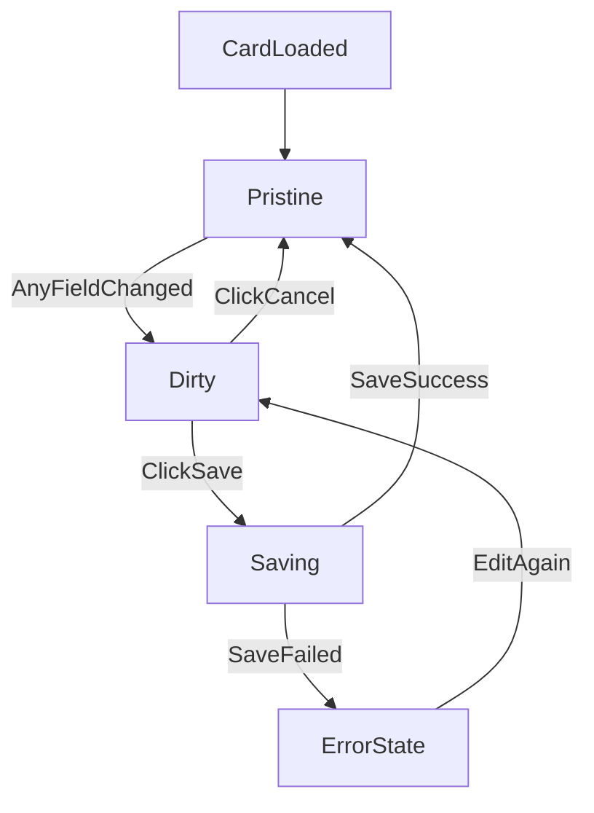

# Tài liệu mô tả giao diện Settings Card

> **Chuẩn hiện tại:** [`admin/docs/SETTINGS-UI-CARDS.md`](../../admin/docs/SETTINGS-UI-CARDS.md). File này giữ làm tham khảo.

Tài liệu này mô tả giao diện quản trị cho màn hình settings, trong đó mỗi setting item được hiển thị theo dạng card độc lập, có inline-edit tiêu đề, form động theo nhóm dữ liệu cố định và đa ngôn ngữ, cùng cơ chế lưu/hủy theo từng card. Tiêu đề/mô tả gắn với **`value.cardMeta`** trong DB (xem admin docs).

## 1) Cấu trúc tổng quan

- Mỗi setting item là **một card** riêng biệt.
- Card gồm 4 vùng chính:
  - `CardHeader`: tiêu đề + mô tả ngắn.
  - `CardContent`: form cấu hình.
  - `CardActions`: nút thao tác.
  - `CardState`: trạng thái thay đổi (`pristine`, `dirty`, `saving`, `error`, `saved`).

## 2) Hành vi tiêu đề card (inline editable)

- Mặc định, tiêu đề card nhìn như text tĩnh để giữ giao diện gọn.
- Thực tế tiêu đề là `text input`.
- Khi `hover` hoặc `focus/click`:
  - Hiện outline/border để người dùng nhận biết có thể chỉnh sửa.
  - Con trỏ chuyển sang trạng thái nhập liệu.
- Khi blur (rời focus), nếu không thay đổi nội dung thì giữ nguyên trạng thái như text.
- Khi có thay đổi nội dung tiêu đề, card chuyển sang trạng thái `dirty`.

## 3) Mô tả ngắn dưới tiêu đề

- Ngay dưới tiêu đề có một đoạn description ngắn, giúp người xem biết card này cấu hình phần nào.
- Description là nội dung định hướng, không cần quá dài (1-2 câu).
- Description có thể tương tác tương tự như tiêu đề

## 4) Nội dung card: dynamic form theo 2 tầng

Phần `CardContent` là dynamic form và có thứ tự hiển thị bắt buộc:

1. **Nhóm không đa ngôn ngữ (non-localized) ở trên**
   - Ví dụ: URL ảnh, link CV, route cố định, toggle hiển thị, metadata chung.
   - Các field này dùng chung cho mọi locale.

2. **Nhóm đa ngôn ngữ (localized) ở dưới**
   - Hiển thị bằng tab ngôn ngữ (`vi`, `en`, ...).
   - Mỗi tab chứa các field text theo ngôn ngữ tương ứng.
   - Chuyển tab không làm mất dữ liệu đã nhập ở tab khác.

## 5) Card actions: lưu/hủy khi có thay đổi

- Khi bất kỳ field nào trong card thay đổi (tiêu đề, non-localized, localized), card chuyển `dirty`.
- Ở trạng thái `dirty`, hiển thị khu vực `CardActions` gồm:
  - `Lưu thay đổi`
  - `Hủy thay đổi`
- Hành vi:
  - `Lưu thay đổi`: submit dữ liệu của **riêng card đó**, chuyển `saving` -> `saved` (hoặc `error` nếu thất bại).
  - `Hủy thay đổi`: rollback về snapshot đã lưu gần nhất của card, quay về `pristine`.
- Khi `pristine`, có thể ẩn hoàn toàn action bar để giảm nhiễu giao diện.

## 6) Trạng thái và phản hồi UI

- `pristine`: chưa chỉnh sửa, không hiện action.
- `dirty`: đã có thay đổi, hiển thị nút lưu/hủy.
- `saving`: khóa input trong card hoặc hiển thị loading cục bộ.
- `saved`: hiển thị feedback ngắn (ví dụ toast hoặc badge “Đã lưu”).
- `error`: hiển thị lỗi theo field hoặc lỗi tổng ở card action.

## 7) Luồng tương tác đề xuất

## 8) Tiêu chí hoàn thành (UI acceptance)

- Mỗi setting item hiển thị thành card độc lập.
- Tiêu đề card có hiệu ứng nhận biết input khi hover/focus/click.
- Có description ngắn dưới tiêu đề.
- Dynamic form đúng thứ tự: non-localized trên, tab localized dưới.
- Chỉ cần thay đổi 1 field bất kỳ là card hiển thị ngay nút lưu/hủy.
- Lưu/hủy hoạt động theo phạm vi từng card, không ảnh hưởng card khác.
